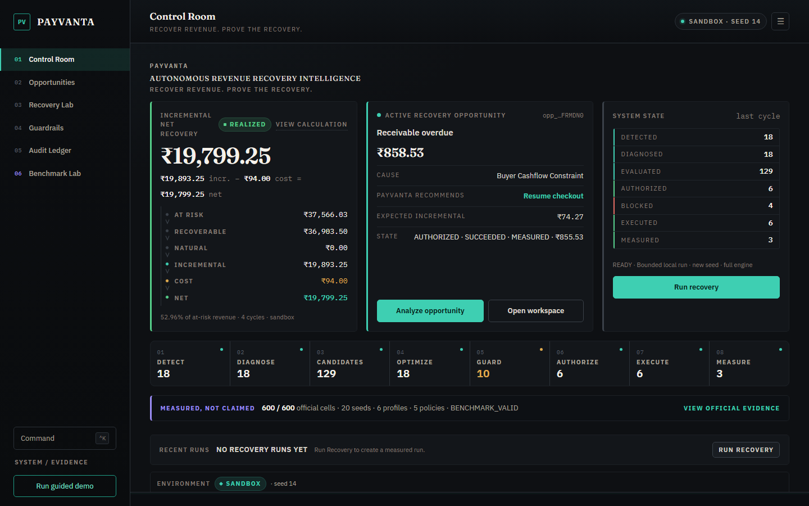
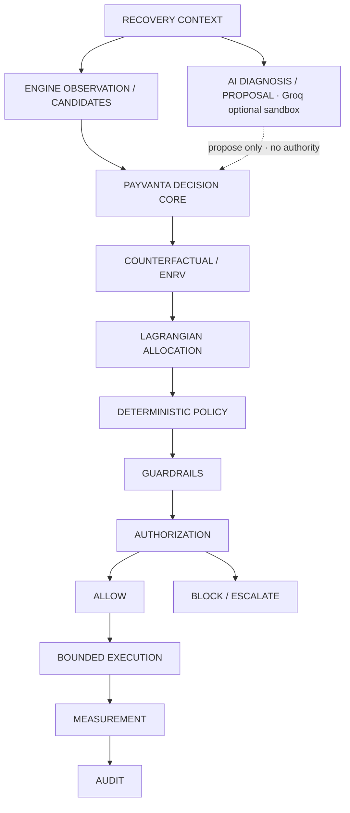

# PAYVANTA

**AUTONOMOUS REVENUE RECOVERY INTELLIGENCE**

**RECOVER REVENUE. PROVE THE RECOVERY.**

PAYVANTA detects revenue at risk, evaluates recovery interventions against a do-nothing counterfactual, selects economically justified actions under constraints, executes only within deterministic controls, measures incremental net recovery, and records an auditable decision trail.

**Track 03 — AI Revenue Recovery**

```
DETECT → INTERVENE → BOUNDED EXECUTE → MEASURE
         ↓
    ESCALATE · STOP · AUDIT
```

| Track 03 bar | Product evidence |
|---|---|
| **DETECT** | Revenue Sentinel · Control Room opportunities | `docs/track3-evidence.md` |
| **INTERVENE** | ENRV + Lagrangian allocation (Groq proposes; engine selects) | `#/opportunity` · Recovery Lab |
| **BOUNDED EXECUTE** | PolicyPack · authorization gate · simulated adapters | `#/guardrails` · `#/receipt` |
| **MEASURE** | Sandbox batch incremental net · receipt measurement | `#/control` · `GET /api/product/overview` |
| **ESCALATE / STOP** | Stopping rules · `REQUIRES_HUMAN_APPROVAL` · BLOCKED | `opp_WST4PPPH81VPNTNC18K0YGRAW9` |
| **AUDIT** | Hash-chained intent-before-result ledger | `#/audit` · `GET /api/audit` |

**Official evaluation:** 600 cells · 20 seeds × 6 profiles × 5 policies · frozen experiment · `LLM_OFF`

Razorpay Buildathon — Track 03: AI Revenue Recovery



*Screenshot: Control Room **with official evidence mounted on the machine that captured it**. The frozen artefact tree is **not** in Git. A fresh clone shows Benchmark Lab as **NOT MOUNTED**, not `BENCHMARK_VALID`. This image is not proof that 600 cells ship in the repository.*

PAYVANTA is a **revenue recovery operating system** for **merchant revenue operations / finance operations** teams.

**Names in this repository (do not confuse them):**

| Name | What it is |
|---|---|
| **PAYVANTA** | Product (this Control Room and recovery OS) |
| **`revive`** | Python package / CLI (`revive control-room`) |
| **REVIVE** | Internal engine **policy id** (`policy_id="REVIVE"`), not the product name |
| **razorpay_buildathon** | Public GitHub repository slug |

The Control Room is a **PAYVANTA Sandbox**: synthetic test population, bounded local execution. It is not official benchmark evidence. Official evidence is read-only and separate.

**INCREMENTAL NET RECOVERY ≠ GROSS COLLECTIONS.** Natural recovery is not a PAYVANTA win.

| | |
|---|---|
| **Explore the Recovery Engine** | `revive control-room` → http://127.0.0.1:8765 |
| **Inspect product state** | GET `/api/product/overview` · UI `#/system` |
| **Architecture** | `docs/43-operating-architecture.md` |
| **Why AI (honest)** | `docs/why-ai.md` |
| **Track 03 map** | `docs/track3-evidence.md` |
| **View Official Evidence** | `artefacts/benchmark/official-cloud-final/` (frozen — do not modify) |

## Contents

- [Inspect PAYVANTA](#inspect-payvanta-human-and-machine)
- [Why PAYVANTA](#why-payvanta)
- [Why AI (honest)](#why-ai-honest)
- [Financial semantics](#financial-semantics)
- [Sandbox batch result](#sandbox-batch-result-seed-14--4-cycles)
- [Demo paths](#demo-paths--success-and-refusal)
- [Problem](#problem)
- [The Recovery OS](#the-recovery-os)
- [How PAYVANTA works](#how-payvanta-works)
- [Track 03](#track-03--ai-revenue-recovery)
- [Architecture](#architecture)
- [Measured, Not Claimed](#measured-not-claimed)
- [How We Got Here](#how-we-got-here)
- [Setup](#setup)
- [Demo](#demo)
- [Technical stack](#technical-stack)

---

## Inspect PAYVANTA (human and machine)

One product. The rendered UI, the JSON APIs, and the engine projection share the same truth. There is no evaluator-only payload.

| Surface | What it exposes |
|---|---|
| `#/control` | Incremental net recovery, active opportunity, system state, recovery pipeline, official evidence ribbon |
| `#/system` | Product, SANDBOX environment, engine, current run, workflow, guardrails, claim → evidence |
| GET `/api/product/overview` | Machine-readable summary of the above |
| GET `/api/snapshot` | Full sandbox projection |
| GET `/api/opportunity/{id}` | Recovery Workspace projection |
| GET `/api/receipt/{id}` | Decision receipt |
| GET `/api/audit` | Audit ledger |
| GET `/api/runs` | Current sandbox seed and run index |
| GET `/api/benchmark` | Benchmark Lab contract + verification + engineering story |
| GET `/api/benchmark/story` | Methodology, M-10, profiles, policies, hardening timeline |
| GET `/api/benchmark/official/summary` | Official evidence summary + `contract` |
| GET `/api/benchmark/official/contract` | Structured official summary (cells, hashes, validation, access) |
| GET `/api/benchmark/official/matrix` | 6 × 5 profile × policy matrix |
| GET `/api/benchmark/official/cell/{seed}/{profile}/{policy}` | One official cell: metrics, checksum, artefact, validation |

Vocabulary used everywhere: **SANDBOX**, **OFFICIAL EVIDENCE**, **BOUNDED EXECUTION**, **INCREMENTAL NET RECOVERY**, **GUARDRAILS**, **AUTHORIZATION**, **AUDIT**, **BENCHMARK**.

---

## Why PAYVANTA

Most recovery systems ask: *“Should we retry?”*

PAYVANTA asks: *“Is recovery worth doing at all, relative to doing nothing, under cost, capacity, policy and authorization constraints?”*

That is a positioning statement — not a performance claim.

Three pillars — not agent count, not chatbot chrome, not “we retry failed payments”:

### 01 · DECISION — Counterfactual / do-nothing economics

PAYVANTA chooses against **do nothing**, not merely against a list of actions. Every intervention is scored on **incremental net recovery** (uplift × value − cost − fatigue) versus natural recovery. Gross conversion is not the win condition.

### 02 · CONTROL — Deterministic guardrails + authorization

**Recommendation ≠ permission.** The engine (ENRV + allocation) selects. Deterministic guardrails, stopping rules, and authorization decide whether anything executes. Optional Groq diagnosis **proposes**; it does not own execution authority.

### 03 · PROOF — Measured outcomes + official 600-cell evaluation

The **same engine** is evaluated across a frozen experiment (not this sandbox run, not Groq):

```
20 seeds × 6 profiles × 5 policies = 600 official cells
```

The repository contains the contract, methodology, and verification logic. The frozen artefact tree is **gitignored** and must be **mounted** to inspect cell scores. Until mounted, Benchmark Lab shows **NOT MOUNTED**, not VERIFIED.

**Not Razorpay Agent Studio.** PAYVANTA is not a platform for building merchant agents and does not claim to be better than Agent Studio. The defensible wedge is: *which recovery action is economically worth taking, relative to doing nothing, under cost, capacity, policy, natural recovery, and authorization constraints?* That is not “retry failed subscriptions.”

---

## Why AI (honest)

PAYVANTA's sandbox uses GPT-OSS 120B through Groq for contextual diagnosis and candidate proposals. The deterministic PAYVANTA engine independently evaluates economic value and controls execution. The official benchmark remains a frozen deterministic evaluation and runs with LLM_OFF.

| Layer | LLM? | Role |
|---|---|---|
| **Official engine / benchmark** | No — `llm_used=False`, `LLM_OFF` | Deterministic ENRV, allocation, guardrails, execution |
| **Product sandbox (optional)** | Yes — Groq `openai/gpt-oss-120b` when `GROQ_API_KEY` is set | Contextual diagnosis + candidate **proposal** only |

| Question | Answer |
|---|---|
| **What is autonomous?** | The recovery cycle: detect → diagnose → compare → allocate → guard → authorize → execute → measure → audit |
| **What does Groq do?** | Interprets sandbox context; proposes cause and candidates — **no execution authority** |
| **What is deterministic?** | Every gate that can permit or block money movement — ENRV, PolicyPack, stopping rules, authorization, execution |
| **What decides the intervention?** | Highest feasible ENRV subject to portfolio constraints; guardrails may override. AI never overrides this. |

**Trust boundary (AI proposes · economics decides · controls authorize):**

```
AI                UNDERSTAND / PROPOSE
        ↓
ECONOMIC ENGINE   EVALUATE / SELECT
        ↓
CONTROL LAYER     VALIDATE / AUTHORIZE
        ↓
EXECUTOR          ACT
        ↓
MEASUREMENT       PROVE
        ↓
AUDIT             RECORD
```

Actual call graph — Groq does **not** enter ENRV:

```
ENGINE CYCLE (run_traced_cycle)
  detect → taxonomy diagnose → candidates → ENRV → allocate
  → guard → authorize → execute/block → measure → audit

OPTIONAL OVERLAY (after engine state exists)
  POST /api/opportunity/{id}/ai-diagnosis
  → Groq structured proposal → UI + product audit (money_path=false)
```

Groq API key must be supplied through `GROQ_API_KEY` (server-side environment only — never in Git or frontend). Without it: **DETERMINISTIC FALLBACK** (honest, no fake AI). Full detail: [`docs/why-ai.md`](docs/why-ai.md) · `GET /api/product/overview` → `ai`

---

## AI architecture

| Layer | Role | Authority |
|---|---|---|
| **Groq GPT-OSS 120B** (optional) | Contextual diagnosis + candidate **proposal** | None over money |
| **Deterministic engine** | ENRV · Lagrangian allocation · guardrails · authorization | Full execution gate |
| **Official benchmark** | Frozen `LLM_OFF` evidence | Read-only |

```
OBSERVED CONTEXT
        │
        ▼
ENGINE CYCLE — run_traced_cycle
detect → taxonomy diagnose → candidates → ENRV → allocate
→ guard → authorize → execute/block → measure → audit
        │
        │  engine state already exists
        ▼
OPTIONAL AI OVERLAY (sandbox)
Groq GPT-OSS 120B · proposal only · money_path=false
```

- **AI ENABLED:** set `GROQ_API_KEY` server-side (never in frontend or Git)
- **DETERMINISTIC FALLBACK:** product runs without the key — no fake AI
- API: `POST /api/opportunity/{id}/ai-diagnosis` · `GET /api/intelligence/status`

See `implementation/ai-substance/` for contract, fallback, and failure modes.

---

Merchants lose revenue in fragments: failed payments, abandoned checkouts, subscription mandate failures, overdue invoices. Recovery effort is finite. So is customer patience. A large share of at-risk revenue would return **without** intervention.

If you count messages sent, or gross recoveries, you will blast everyone and call natural repayment a win.

The real question is:

> Where should the next unit of recovery effort go so that **incremental net recovery** is maximized under policy, risk, and resource constraints?

---

## The Recovery OS

```
Revenue Signal
      ↓
Cause
      ↓
Opportunity
      ↓
Counterfactual options
      ↓
Economic optimization
      ↓
Policy / risk / resource guard
      ↓
Authorization
      ↓
Execution
      ↓
Measurement
      ↓
Incremental net value
      ↓
Evidence
```

Primary metric: **INCREMENTAL NET RECOVERY**

Secondary: recoverable revenue · recovery rate · realized cost · authorized interventions · blocked interventions · policy compliance · execution integrity

---

## How PAYVANTA works

1. **Detect** recoverable revenue as typed opportunities, not a ticket dump.
2. **Diagnose** candidate causes from observable evidence (closed taxonomy — not a claimed root-cause oracle).
3. **Generate** alternatives, including **do nothing**.
4. **Compare** each option on expected incremental net recovery: uplift × value − cost − fatigue.
5. **Allocate** the portfolio under simultaneous resource limits.
6. **Guard** with deterministic gates and stopping rules.
7. **Authorize** — or block with a recorded reason.
8. **Execute** only authorized actions, idempotently, against simulated rails.
9. **Measure** gross vs natural vs incremental vs net.
10. **Prove** the claim with an audit reference and a sealed 600-cell benchmark.

**Inspect opportunity** is a presentation trigger — the recovery cycle already ran at session boot via `run_traced_cycle`. It does not start autonomy on click.

Diagnosis, ENRV, and allocation on the **engine path** are deterministic (`llm_used=False`, official benchmark `LLM_OFF`). The **sandbox** may additionally call Groq `openai/gpt-oss-120b` for contextual diagnosis and candidate **proposals**. That overlay does not authorize or execute. See [Why AI](docs/why-ai.md).

**Real product loop:**

```
DETECT → DIAGNOSE → CANDIDATES → ENRV / COUNTERFACTUAL → ALLOCATE
→ GUARD → AUTHORIZE → EXECUTE → MEASURE → AUDIT
```

## Track 03 — AI Revenue Recovery

Official bar: detect revenue at risk → determine the right intervention → execute a bounded recovery workflow. Then: measured money recovered across a batch, compliant escalation, stopping rules, audit trail.

```
DETECT
  ↓
DIAGNOSE
  ↓
COMPARE
  ↓
SELECT
  ↓
GUARD
  ↓
AUTHORIZE
  ↓
EXECUTE
  ↓
MEASURE
  ↓
AUDIT
```

**Batch recovery** + **compliant escalation** + **stopping rules** are in the engine, the Control Room, and the tests. Map: `docs/track3-evidence.md`.

Sandbox shows one working batch. Official Benchmark Lab evaluates the **same engine** across 600 frozen cells. Do not conflate them.

---

## Architecture

**Agent loop (money path):** `revive/product/trace.py` `run_traced_cycle`. UI Analyze is a **presentation trigger**, not autonomy.



Groq is a **sandbox overlay**. It does not sit above ENRV in the call graph. Official experiment is parallel and frozen (`LLM_OFF`).

Details: `docs/43-operating-architecture.md`, `docs/why-ai.md`.

---

## Recovery Opportunity Graph

Each opportunity is a structured object linking customer, payment / invoice / subscription, failure evidence, diagnosis, candidate interventions, expected value, cost, policy state, authorization, execution, and realized outcome.

Only relationships that exist in engine state are shown. No decorative causal fiction.

---

## Counterfactual Recovery

For every priced opportunity PAYVANTA can show:

| Option | Expected recovery | Cost | Incremental net | Policy |
|---|---|---|---|---|
| Intervention A / B / C | from `CandidateValuation` | cost + incentive | ENRV | availability / approval |
| Do nothing | natural recovery | 0 | 0 by definition | always legal |

The selection line is:

> Chosen because it maximized expected incremental net recovery subject to policy, resource, risk and authorization constraints.

---

## Guardrail Proof

Safety is not a paragraph. Every consequential action carries the pipeline:

**Detected → Diagnosed → Optimized → Guarded → Authorized → Executed → Measured**

Blocked actions show the engine reason (budget, policy, duplicate, cooldown, approval, unsafe). Unauthorized actions never reach adapters. That is structural, not a UI filter.

---

## Execution Integrity

- Integer paise only for money that moves
- Sealed PolicyPack on the official path
- Idempotency keys
- Hash-chained audit (`ACTION_INTENT` before effect)
- Measurement never overwrites the prediction that justified the action

---

## Financial semantics

| Term | Meaning |
|---|---|
| **AT RISK** | Revenue exposed to potential loss |
| **NATURAL** | Recovery that occurs without intervention |
| **INCREMENTAL** | Recovery attributable to intervention beyond natural recovery |
| **COST** | Resource / recovery cost of the intervention |
| **NET** | Incremental recovery minus cost |

**INCREMENTAL NET RECOVERY ≠ GROSS COLLECTIONS.** Natural recovery is not a PAYVANTA win.

```
Revenue at risk
    → potentially recoverable
    → naturally recoverable
    → incrementally recoverable
    → intervention cost
    → incremental NET recovery
```

## Sandbox batch result (seed 14 · 4 cycles)

**SANDBOX BATCH RESULT — NOT OFFICIAL M-10**

Verified from `GET /api/product/overview` on the default Control Room session:

| Metric | Value |
|---|---|
| Incremental recovery | ₹19,893.25 |
| Cost | ₹94.00 |
| **Incremental net recovery** | **₹19,799.25** |
| Natural recovery (this scenario) | ₹0.00 |

**Pulse (last cycle):** Detected **18** · Diagnosed **18** · Evaluated **129** candidates · Authorized **6** · Blocked **4** · Executed **6** · Measured **3**

This is the same engine path as the official experiment, running on a synthetic sandbox population — not a frozen benchmark cell score.

## Demo paths — success and refusal

Both paths are prepared on seed 14. Do **not** press Run Recovery during the pitch (it rebuilds the sandbox world).

| Path | Opportunity | Expected chain |
|---|---|---|
| **SUCCESS** | `opp_CQ6VCH7HPPW9WG284G5EFRMDN0` | AUTHORIZED → SUCCEEDED → MEASURED |
| **BLOCKED** | `opp_WST4PPPH81VPNTNC18K0YGRAW9` | BLOCKED → APPROVAL DENIED → NOT_EXECUTED |

UI: `#/opportunity/{id}` · API: `GET /api/opportunity/{id}` · Receipt: `GET /api/receipt/{id}`

The blocked path proves refusal-to-act is structural, not a UI filter.

---

## Measured, Not Claimed

The Control Room is a **sandbox demonstration**. The official benchmark is the **experimental proof and engineering validation layer around the product**. They are not the same run.

This is the engine you just saw operating. That engine was evaluated separately across a frozen experiment.

| | |
|---|---|
| Deterministic seeds | **20** |
| Operating profiles | **6** |
| Evaluated policies | **5** — B0, B1, B2, B3, **REVIVE** |
| Official cells | **600** = 20 × 6 × 5 |
| Evaluation groups | **120** = 20 × 6 |
| Workers | **8** |
| Validation | **BENCHMARK_VALID** |
| Blocked | **false** |

Frozen experiment reference:

`cc8cad59779fd594f26599d5c8d7b965f774cff83a70eb44f9673e1e7556e4b0`

`REVIVE` is the **internal policy identifier** (`policy_id="REVIVE"`), not the product name.

**Why this design (not a statistical claim about production):**

| Axis | Why |
|---|---|
| 20 seeds | Deterministic variation with repeatability. Same seed, same world. Twenty draws rather than one selected scenario. |
| 6 profiles | Different operating environments — mixed, high natural recovery, scarce, abundant, hostile, degraded. |
| 5 policies | Comparative evaluation on identical inputs: do-nothing, fixed retry, contact-all, greedy ENRV, PAYVANTA. |
| 600 cells | Systematic coverage: every seed × profile × policy, once. A cell is an evaluation, not a demo. |
| 120 groups | One world (seed × profile) under all five policies. |

Primary metric **M-10** = Incremental Net Recovery = `NetRecovered(policy) − NetRecovered(B0)` on the same seed and profile. It can be negative. It is not the Control Room sandbox figure.

Profiles (from `revive/simulation/profiles.py` / `docs/19-synthetic-dataset.md`):

| Profile | Character |
|---|---|
| BALANCED | Mixed classes, moderate scarcity — primary benchmark profile |
| HIGH_NATURAL | Many opportunities self-recover; punishes over-contacting |
| SCARCE | Severe budget/capacity limits; stresses allocation |
| ABUNDANT | Near-unlimited capacity; expected to shrink allocator advantage |
| HOSTILE | Heavy adversarial injection; tests guardrails and stopping |
| DEGRADED | Provider outage windows; timing-sensitive recovery |

Policies (from `docs/20-benchmark.md`; official run used these five):

| ID | Baseline | Isolates |
|---|---|---|
| B0 | NO_ACTION | Natural recovery floor |
| B1 | FIXED_RETRY | Retry without targeting |
| B2 | CONTACT_ALL | Effort without prioritisation |
| B3 | GREEDY_ENRV | Scoring without constrained allocation |
| REVIVE | PAYVANTA recovery policy | The engine under test |

### Official validation

When `artefacts/benchmark/official-cloud-final/` is mounted, Benchmark Lab verifies 600 cells, the frozen hash, config hash, PolicyPack, and `BENCHMARK_VALID`. The product never writes that tree. Do not rerun the official benchmark into it.

### How official evidence is supplied

`artefacts/` is gitignored. A fresh clone still contains this methodology, the declared 20×6×5 contract, the M13.24–M13.27 engineering records, the tests, and the machine-readable story:

- `GET /api/benchmark/story`
- `GET /api/benchmark/official/contract`
- `docs/42-official-benchmark.md`

To verify the frozen run, **mount** the official cloud-final tree at `artefacts/benchmark/official-cloud-final/` without modifying it. Until it is present, cell counts and M-10 figures are not claimed.

### Benchmark methodology

Deterministic seeds · six generation profiles · five policies · 600 cells · 120 groups · eight workers · read-only artefacts · paired M-10 vs B0. Details: `docs/20-benchmark.md`, `docs/21-evaluation.md`.

### Cloud validation (M13.27 gate)

**CLOUD VALIDATION — not a benchmark score improvement.**

| Field | Verified value |
|---|---|
| seed / profile / policy | 1 · ABUNDANT · REVIVE |
| cycles | 2016 |
| wall time | 627.3s |
| peak RSS | 594 MB |
| executions | 339,890 |
| authorizations | 404,319 |
| measurements | 339,890 |
| metrics checksum | `80c238eb…5113da` |
| run_valid | true |

This confirms the production-shaped cell path after the metrics-tail rescue. It does not change M-10 scores.

### Engineering hardening journey

See [How We Got Here](#how-we-got-here). Parallel dispatch, checkpoint repair, ABUNDANT forensics, metrics-tail rescue, cloud validation, then the official 600-cell run. That journey is **performance and reliability engineering**, not an M-10 score improvement.

### Cell drilldown

Inspect one result: **ABUNDANT × REVIVE × seed 14**.

- UI: `#/benchmark/matrix`
- API: `GET /api/benchmark/official/cell/14/ABUNDANT/REVIVE`

Metrics, checksum, artefact path, `run_valid`.

### Limitations

- Sandbox ≠ production. Simulated adapters. No live Razorpay merchant integration in this submission.
- Population is synthetic, not production traffic.
- Official experiment scope is 20 × 6 × 5. It does not evaluate every policy or real-world cohort.
- M-10 measures incremental net vs do-nothing on that frozen world. It does not guarantee recovery.
- 600 cells do not prove superiority, scientific certainty, or production fitness.

### Claim → evidence

| Claim | Source | Test | UI | API |
|---|---|---|---|---|
| 600 official cells | `official-cloud-final/` | `test_verify_evidence_passes` | `#/benchmark` | `/api/benchmark/official/contract` |
| BENCHMARK_VALID | `validation.json` | `test_summary_provenance_fields` | `#/benchmark/evidence` | `/api/benchmark/official/summary` |
| M-10 | per-cell artefacts vs B0 | `test_cell_lookup_abundant_revive_seed_14` | `#/benchmark/matrix` | `/api/benchmark/official/cell/14/ABUNDANT/REVIVE` |
| Sandbox is not a cell | Control Room snapshot | `test_overview_matches_sandbox_snapshot` | `#/control` | `/api/product/overview` |

We did not stop at a working demo. We built the infrastructure to stress, profile, repair, optimize, validate, and finally evaluate the engine across 600 official experiment cells.

---

## How We Got Here

Disciplined iteration. Not a single lucky run.

| Milestone | What broke | What we did | What was measured |
|---|---|---|---|
| **M13.24** Parallel dispatch | `--workers` parsed; stress path dropped it → workers=8 ran sequentially | Forward workers into the cell runner | workers=1 / 2 / 8 fingerprints match. 10-cell stress wall 72.3s → 39.8s → 31.7s (2 groups — not an 8× speedup) |
| **M13.25** Checkpoint repair | Cells persisted atomically; manifest advanced only after a full 5-policy group. 4/5 files, manifest still 26/30 | Startup reconciliation, drift detection, parent-owned checkpoint updates | files-ahead, manifest-ahead, corrupt cell, partial group, production-shaped interruption, resume |
| **M13.26** Forensic profiling | ABUNDANT × REVIVE much slower (not a hang) | Profiled M6 / M7 / M8. ABUNDANT headroom → ~340k executions → Lagrangian hot path | BALANCED 555.1s · SCARCE 486.5s · HOSTILE 539.7s · ABUNDANT 1363.0s |
| **M13.27** Metrics-tail rescue | `O(authorization × execution)` unauthorized cross-scan | Indexed aggregation. Semantics unchanged | ~4137.6s scan → ~0.321s local / ~0.39s cloud tail. Cell ~9900s → ~627.3s. **Performance, not a score** |
| **Cloud validation** | Confirm production cell path | seed=1 ABUNDANT REVIVE, 2016 cycles | 627.3s · 594 MB peak RSS · 339,890 executions · checksum `80c238eb…5113da` · `run_valid=true` · violations=0 |
| **Official evaluation** | Evaluate the engine, not one demo | Frozen 20 × 6 × 5 | **600 cells · 120 groups · BENCHMARK_VALID · blocked=false** |

Records: `implementation/m13-24-stress-worker-dispatch/`, `implementation/m13-25-checkpoint-repair/`, `implementation/m13-26-abundant-revive-forensics/`, `implementation/m13-27-metrics-tail-rescue/`.

### Why this was hard

Benchmark engineering here is not a single lucky run. The compelling work is:

| Challenge | Why it mattered |
|---|---|
| **Checkpoint integrity (M13.25)** | A crash mid-group could leave cells on disk ahead of the manifest — resume had to become a verified invariant |
| **Parallel execution (M13.24)** | `--workers=8` was parsed but dropped on the stress path — throughput lied until workers propagated |
| **ABUNDANT scaling (M13.26)** | ABUNDANT × REVIVE is not a hang — it produces ~340k executions and stresses Lagrangian selection |
| **Metrics aggregation (M13.27)** | An `O(authorization × execution)` tail turned a finished cell into a multi-hour wait |
| **Cloud validation** | Confirmed metric equality and checksums on a production-shaped cell after the rescue |

---

## Setup

**OS:** Windows, macOS, or Linux. **Python:** 3.11+. No extra web framework. Control Room runs **without** API keys (**DETERMINISTIC FALLBACK**). Optional sandbox AI: set `GROQ_API_KEY` server-side only.

```bash
python -m pip install -e ".[dev]"
revive control-room
```

Default: http://127.0.0.1:8765  
Optional: `revive control-room --port 8765 --host 127.0.0.1`

Browser: any current Chromium/Firefox/Safari. Open `#/control`.

**Official evidence:** the frozen cell tree is **not committed** to this repository (`.gitignore` includes `artefacts/`). The repo contains the **contract, methodology, and verification logic**. For cell-level inspection, mount `artefacts/benchmark/official-cloud-final/` locally. Do not silently recreate it. Do not call an unmounted contract “evidence.” Without the tree, Control Room still runs; Benchmark Lab shows **NOT MOUNTED** and does not invent cell scores.

Do **not** rerun the official 600-cell benchmark into that directory.

---

## Repository map

| Path | Role |
|---|---|
| `revive/` | Core recovery engine + product server |
| `revive/product/intelligence/` | Optional Groq diagnosis / proposal layer |
| `revive/benchmark/` | Benchmark machinery (official contract under `official/`) |
| `tests/` | Engine, product, and evidence validation |
| `docs/` | Architecture, benchmark methodology, Track 03 evidence |
| `submission/` | Pitch script, form answers, release reports |
| `artefacts/benchmark/official-cloud-final/` | **Mounted read-only** — not in Git |

Machine-readable discovery: `GET /api/product/overview` · `GET /api/benchmark/story` · `GET /api/benchmark/official/contract`

---

## Limitations

- **Sandbox ≠ production.** Simulated adapters. No live Razorpay merchant payment execution in this submission.
- **Population is synthetic**, not production traffic.
- **Official 600-cell artefacts are mounted separately.** A fresh clone shows Benchmark Lab as **NOT MOUNTED**.
- **Official benchmark uses `LLM_OFF`.** Groq is sandbox overlay only — contextual proposal support, not authorization.
- **600 cells prove systematic evaluation of the frozen engine** — not universal superiority, production fitness, or guaranteed recovery.

---

## Demo

```bash
python -m pip install -e ".[dev]"
revive control-room
```

Open http://127.0.0.1:8765 — Control Room first viewport. Do **not** click Run Recovery during the five-minute path (it rebuilds the sandbox world). Batch numbers are already on the Control Room.

| Time | Beat |
|---|---|
| 0:00 | Control Room — money, active opportunity, system state |
| 0:20 | Active recovery opportunity |
| 0:40 | Inspect opportunity (cycle already ran) |
| 1:15 | Recovery Lab — do nothing vs interventions |
| 1:40 | PAYVANTA recommends |
| 2:00 | Guardrails |
| 2:20 | Authorization |
| 2:40 | Execution |
| 3:00 | Measurement |
| 3:20 | Decision receipt |
| 3:40 | Audit ledger |
| 4:00 | Batch on Control Room |
| 4:10 | “Now let’s see whether this is just one carefully selected scenario.” |
| 4:15 | 20 × 6 × 5 |
| 4:20 | 600 official cells |
| 4:25 | 120 groups |
| 4:30 | Profile × policy matrix |
| 4:35 | ABUNDANT × REVIVE |
| 4:40 | Seed 14 |
| 4:45 | Cell evidence + checksum |
| 4:50 | “Same engine. Measured across the experiment.” |
| 5:00 | MEASURED. NOT CLAIMED. |

Control Room numbers are a **PAYVANTA Sandbox** session (synthetic test population, bounded local execution). They are not official benchmark scores. Official evidence lives at `artefacts/benchmark/official-cloud-final/`.

UX spec: `docs/25-ui-ux-spec.md` · Demo script: `docs/26-demo-script.md`

---

## Technical stack

Python 3.11+ · package namespace `revive` (unchanged) · CLI `revive` · pytest · integer paise · sealed PolicyPack · official frozen benchmark harness.

No extra web framework: the Control Room is served by the stdlib HTTP server.

```bash
pytest
revive generate-dataset --seed 42 --profile BALANCED --output artefacts/datasets/dev
```

**Do not** rerun the official 600-cell benchmark into production evidence directories.

---

## Naming

| Name | Role |
|---|---|
| **PAYVANTA** | Public product |
| **REVIVE** | Benchmark policy id — keep |
| **revive** | Python / CLI namespace — keep |
| **B0–B3** | Baseline policy ids — keep |
