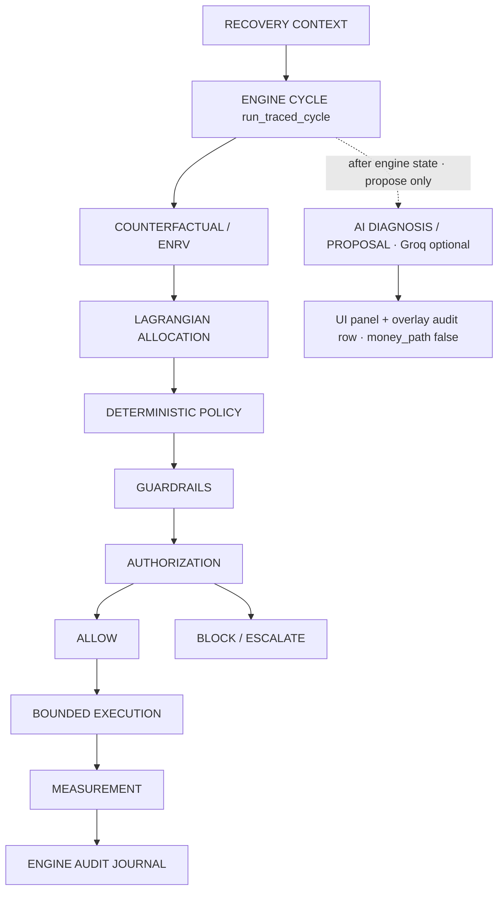
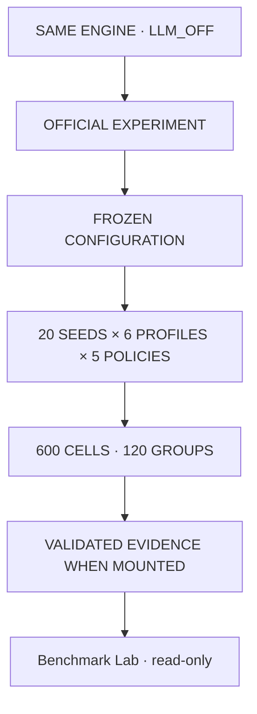
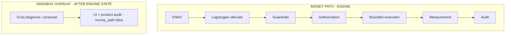

# 43 · Operating architecture (as implemented)

This is the architecture of **the shipped PAYVANTA**, not the unimplemented
spec agents in `docs/08`. Spec vs implementation: [why-ai.md](why-ai.md).

**Names:** PAYVANTA = product · `revive` = Python package · REVIVE = internal
policy id · this GitHub repo is `razorpay_buildathon`.

---

## 1. Two paths (do not merge them)

### Money path — the agent loop

`revive/product/trace.py` · `run_traced_cycle`

A UI click (**Inspect opportunity**) is a **presentation trigger**. It does not
make the cycle autonomous. Autonomy is the engine running detect → measure
across the batch without a human per opportunity.

```
DETECT → DIAGNOSE (taxonomy) → CANDIDATES → ENRV → ALLOCATE
  → GUARD → AUTHORIZE → EXECUTE (if AUTHORIZED) → MEASURE → AUDIT
```

### Sandbox overlay — optional Groq

`POST /api/opportunity/{id}/ai-diagnosis`

Groq `openai/gpt-oss-120b` may interpret already-observed context and return a
structured **diagnosis / candidate proposal**. It is invoked **after** engine
state exists. It does **not** enter ENRV, allocation, policy, authorization, or
adapters. Dotted lines below are display-only. There is no causal arrow into
the money path.

```
RECOVERY CONTEXT
        │
        ▼
ENGINE CYCLE — run_traced_cycle
DETECT → TAXONOMY DIAGNOSE → CANDIDATES → ENRV → ALLOCATE
→ GUARD → AUTHORIZE → EXECUTE or BLOCK → MEASURE → AUDIT
        │
        │  engine state already exists
        ▼
OPTIONAL SANDBOX OVERLAY
POST /ai-diagnosis → Groq proposal (UI + product audit row, money_path=false)
```



Intelligence (engine ENRV/allocation; optional Groq proposal) **proposes**.
Deterministic controls **permit or refuse**.
Execution cannot start without `AUTHORIZED`.

---

## 2. Official experiment (parallel, frozen)



Sandbox ≠ cell. Evidence path:
`artefacts/benchmark/official-cloud-final/` (**gitignored**; mount to verify).

The public repo contains **contract, methodology, verification logic**.
Cell scores exist only when the artefact tree is mounted and verified.
Unmounted workspace: **NOT MOUNTED** — not VERIFIED.

---

## 3. Trust boundary



No edge from Groq to ENRV, allocation, policy, authorization, or adapters.
Groq cannot skip CONTROL. Official benchmark never calls Groq (`LLM_OFF`).

---

## 4. Product surfaces

| Human | Machine |
|---|---|
| `#/control` Control Room | `GET /api/product/overview` |
| `#/opportunity/{id}` Workspace | `GET /api/opportunity/{id}` |
| `#/audit` | `GET /api/audit` (engine ledger + optional overlay rows) |
| `#/benchmark` | `GET /api/benchmark` · `/official/contract` |

---

## 5. What does not execute

- Groq output as authorization or adapter input
- Writes to official evidence (HTTP 405)
- Adapter calls for `BLOCKED` / unapproved states
- Package rename (`revive` stays)
