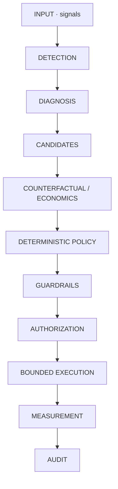
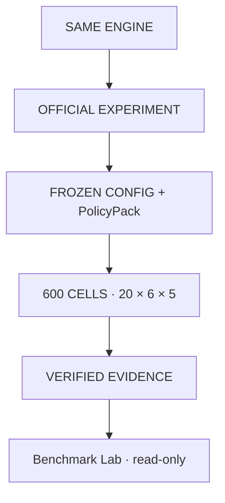

# 43 · Operating architecture (as implemented)

This is the architecture of **the shipped PAYVANTA**, not the unimplemented LLM
agents in the original spec. Spec vs implementation: [why-ai.md](why-ai.md),
[08-agent-architecture.md](08-agent-architecture.md) (status banner).

---

## 1. Recovery loop

Intelligence (diagnosis, ENRV, allocation) **proposes**.  
Deterministic controls **permit or refuse**.  
Execution cannot start without `AUTHORIZED`.

---

## 2. Official experiment (parallel, frozen)

Sandbox ≠ cell. Evidence path:
`artefacts/benchmark/official-cloud-final/` (gitignored; mount to verify).

---

## 3. Product surfaces

| Human | Machine |
|---|---|
| `#/control` Control Room | `GET /api/product/overview` |
| `#/opportunity/{id}` Workspace | `GET /api/opportunity/{id}` |
| `#/audit` | `GET /api/audit` |
| `#/benchmark` | `GET /api/benchmark` · `/official/contract` |

---

## 4. What does not execute

- LLM calls (`llm_used=False`, official `LLM_OFF`)
- Writes to official evidence (HTTP 405)
- Adapter calls for `BLOCKED` / unapproved states
- Package rename (`revive` stays)
