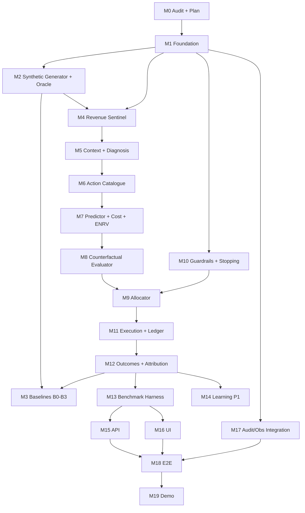

# PAYVANTA — Dependency Map

**Phase:** M0  
**Purpose:** Module and milestone dependencies for controlled implementation order.

---

## 1. Milestone dependency graph



---

## 2. Component dependency matrix

Rows depend on columns being available first.

| Component | Depends on |
|-----------|------------|
| **C-25 Generator + Oracle** | Virtual clock, PRNG, data model DOMAIN tables |
| **C-01 Signal Ingestor** | Schema validation, Signal tables |
| **C-02 Revenue Sentinel** | C-01, DOMAIN reads, policy pack windows |
| **C-03 Degradation Monitor** | Transaction history, rolling stats (P1) |
| **C-04 Context Enricher** | Customer, Intervention history, instruments |
| **C-05 Root Cause Analyst** | Failure taxonomy, optional LLM cache |
| **C-06 Candidate Generator** | Action catalogue, risk class + cause rules |
| **C-07 Recovery Predictor** | StrategyVersion cells, feature vector |
| **C-08 Cost Model** | Action params, merchant policy (λ_f, costs) |
| **C-09 Counterfactual Evaluator** | C-07 + C-08 outputs |
| **C-11 Policy Pre-Filter** | C-13 gate rules (subset), consent/contact state |
| **C-12 Recovery Allocator** | Priced candidates, C-16 capacity snapshot, ε |
| **C-13 Policy Engine** | PolicyPack, customer consent, ledger limits |
| **C-14 Stopping Rules** | Opportunity state, SR config |
| **C-15 Approval Queue** | G7 thresholds, human/simulated approver |
| **C-16 Resource Ledger** | Budget tables, reservation handles |
| **C-17 Execution Agent** | ALLOW verdict, reservation, idempotency store |
| **C-18 Adapters (sim)** | Oracle partition (outcome lookup only) |
| **C-19 Outcome Observer** | Adapter results, virtual clock horizon H |
| **C-20 Attribution Classifier** | Outcomes, intervention timing |
| **C-21 Learning Engine** | Outcomes, predictor cells (no policy writes) |
| **C-22 Audit Store** | Hash chain genesis from run config |
| **C-23 Cycle Orchestrator** | All pipeline modules |
| **C-24 Benchmark Harness** | Full pipeline + baselines + metrics |
| **C-26 Metrics/Report** | Run artefacts, metric dictionary formulas |
| **C-27 API** | DB + artefact reader |
| **C-28 UI** | C-27 API + precomputed artefacts |

---

## 3. Data layer dependencies

```
DOMAIN (generator writes, engine reads)
  ↓
SIGNAL (ingestor)
  ↓
CORE (opportunity → … → outcome)
  ↓
CONTROL (policy, ledger, idempotency)
  ↓
LEARNING (strategy versions — P1)
  ↓
RECORD (audit, cycles, metrics)

ORACLE (generator only; adapter reads at execution; policy NEVER reads)
```

**Write-direction rule:** CORE never writes DOMAIN. LEARNING never writes CONTROL policy tables (`RR-GUARD-022`). RECORD is append-only.

---

## 4. Test dependency map

| Test suite | Requires |
|------------|----------|
| Unit: ENRV, gates, states | M1 types + pure functions |
| Unit: Sentinel | M2 fixture signals |
| Integration: pipeline slice | M4–M8 for pricing path |
| Integration: full cycle | M9–M12 |
| Safety: bypass attempts | M10 + M11 |
| Benchmark: reproducibility | M13 + frozen config hash |
| E2E: demo scenario | M18 all P0 |

---

## 5. External dependencies (pinned)

| Dependency | Purpose | Benchmark path? |
|------------|---------|-----------------|
| Python 3.11+ | Runtime | Yes |
| SQLite | Persistence | Yes |
| pytest | Testing | Yes |
| numpy/scipy (optional) | Optimisation helpers | Yes if used |
| HTTP framework (FastAPI/Flask) | API | No (UI/demo only) |
| Frontend (React/Vite) | UI | No |
| Anthropic SDK | LLM (P1, cached) | No in default benchmark |

**RR-NFR-092:** Benchmark path must run with no network.

---

## 6. Parallel work streams (after M1)

Safe to parallelise only where dependencies allow:

| Stream A | Stream B |
|----------|----------|
| M2 Generator | M10 Gate engine (needs schema only) |
| M4 Sentinel | M17 Audit store skeleton |
| M15 API stubs | M7 Predictor (once M6 done) |

**Do not parallelise:** Allocator (M9) before pricing (M7–M8) and gates (M10).

---

## 7. Requirement block dependencies

| Block | Blocks |
|-------|--------|
| `RR-DATA-*` / generator | Everything |
| `RR-FUNC-001`…`007` (SEE) | UNDERSTAND, SIMULATE |
| `RR-FUNC-023`…`028` (SIMULATE) | PRIORITIZE |
| `RR-GUARD-*` | ACT |
| `RR-FUNC-060`…`065` (ACT) | VERIFY, benchmark outcomes |
| `RR-FUNC-070`…`073` (VERIFY) | `M-10`, learning |
| `RR-BENCH-*` | Demo, UI screen 7 |
| `RR-UI-*` | Benchmark artefacts |
